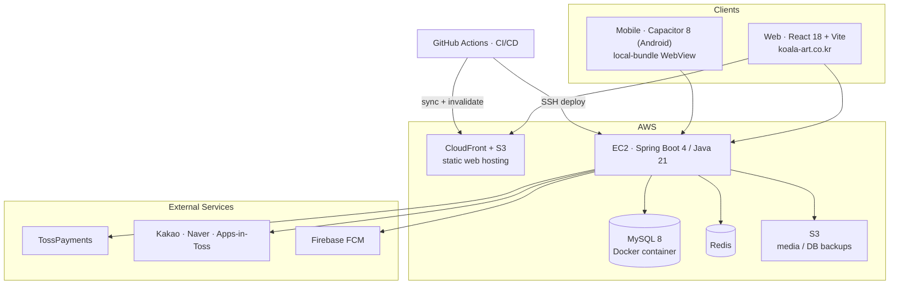
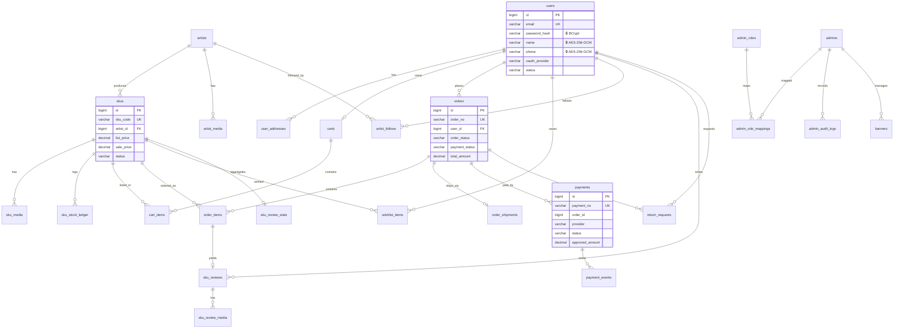
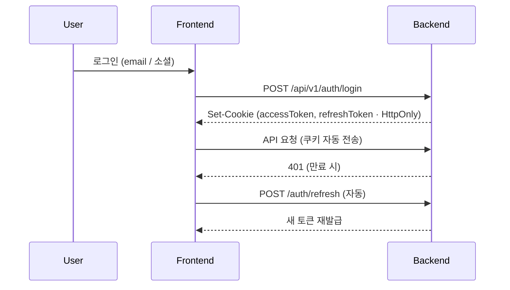
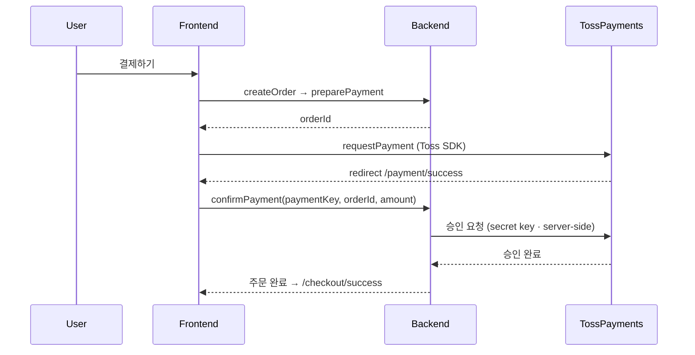
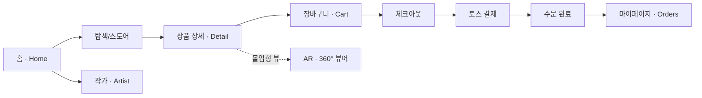

# 🎨 KoALa — 한국 미술품 거래 플랫폼 · Korean Art Marketplace

> **작가와 컬렉터를 잇는 프리미엄 K-아트 커머스** — 웹·안드로이드 멀티플랫폼, 실물 미술품 결제·배송까지.
> A premium K-art commerce platform connecting artists and collectors — multi-platform (Web + Android), with real payment & shipping.

### 🔗 **[▶ 라이브 사이트 · Live Site — koala-art.co.kr](https://koala-art.co.kr/)**

  

  
  
  
  
  
  
  

---

## 📌 개요 · Overview

| | |
|---|---|
| **한 줄 소개** | 미술품(조각·회화·아트토이·도자기)을 온라인에서 감상·구매·수집하는 커머스 플랫폼 |
| **Summary** | An e-commerce platform to browse, purchase, and collect fine art & collectibles online |
| **구성 · Structure** | 3-repo 모노 아키텍처 — 백엔드 API · 웹 프론트 · 모바일 앱 |
| **특징 · Highlights** | 멀티플랫폼 · 토스 결제 · 소셜 로그인 · PII 암호화 · AR/360 뷰어 · 자동 CI/CD |

---

## 📊 프로젝트 진행 현황 · Project Status

| 영역 · Area | 상태 · Status | 완성도 |
|---|---|:---:|
| 백엔드 API · Backend | 🟢 운영 중 · Live | ~90% |
| 웹 · Web (`koala-art.co.kr`) | 🟢 운영 중 · Live | ~85% |
| 안드로이드 앱 · Android | 🟡 출시 준비 · Pre-launch | ~70% |
| iOS 앱 · iOS | ⚪ 계획 · Planned | – |
| 인프라 / CI·CD · Infra | 🟢 구축 완료 · Done | 100% |

**✅ 완료 · Done**
- 회원가입 · 소셜 로그인(카카오·네이버) · JWT 인증
- 상품 · 작가 · 갤러리 · 검색 · 위시리스트
- 장바구니 · 주문 · **토스페이먼츠 결제** · 리뷰(구매 검증)
- 관리자: 상품 · 주문 · 배너 · 회원 · 반품 · 리뷰 · 공지 · 문의
- **PII 컬럼 암호화(AES-256-GCM)** · 관리자 RBAC/IP 화이트리스트/감사로그
- **CI/CD 자동 배포**(GitHub Actions) · **일 1회 DB 자동 백업**
- **AR / 360° 뷰어** · 브랜드 CI(네이비·레드) 적용
- 법적 페이지(약관 · 개인정보 · 청소년보호 · 계정삭제)

**🔄 진행 중 · In Progress**
- 앱인토스 **토스 로그인**(mTLS) — 코드 완료, 인증서·키 발급 대기
- 안드로이드 **플레이스토어 출시** — 릴리스 서명 완료, 콘솔 등록 진행

**📋 예정 · Roadmap**
- iOS 지원 (Capacitor iOS · macOS 빌드 환경)
- **3D 세계수 메인 히어로** (three.js — 스크롤에 따라 작품이 가지에서 피어나는 인터랙션)
- 검색 서버사이드 고도화 · 결제 라이브 전환

---

## 🧩 레포 구성 · Repositories

| Repo | 역할 · Role | Stack |
|---|---|---|
| **KoALa-back** | REST API 서버 · 도메인/보안/결제 | Spring Boot 4 · Java 21 · MySQL · Redis |
| **Koalaweb** | 고객 + 관리자 웹 | React 18 · Vite · Tailwind · Three.js |
| **KoALa-mobile** | 안드로이드 앱 (WebView 로컬 번들) | Capacitor 8 · React · FCM |

> 웹·모바일은 **동일한 React/TypeScript 스택**을 공유하고, 모바일은 Capacitor 네이티브 셸(푸시·카메라·오프라인)을 얹습니다.

---

## 🏗️ 시스템 아키텍처 · System Architecture

- **EC2(Ubuntu)** 위 Spring Boot(systemd) + **Docker MySQL 8** + Redis
- **정적 웹**은 S3 + CloudFront, **미디어·DB 백업**은 S3
- **CI/CD**: `main` push → GitHub Actions 자동 배포 (백엔드 SSH · 웹 S3 동기화). 일 1회 DB 백업 → S3

---

## 🗃️ 데이터 모델 · Data Model (ERD)

> 24개 테이블 / 14개 도메인. 아래는 핵심 도메인 관계 (Flyway V1~V19 기준).

**도메인 · Domains (14):** `admin` · `artist` · `artwork` · `banner` · `cart` · `inquiry` · `notice` · `order` · `payment` · `returnrequest` · `review` · `sku` · `user` · `wishlist`

---

## 🔐 인증 흐름 · Authentication Flow

- **이메일 로그인** + **소셜 로그인** (카카오 · 네이버 · 앱인토스)
- JWT를 **HttpOnly 쿠키**로 발급 → XSS 토큰 탈취 방지
- 401 발생 시 **자동 리프레시 토큰 재발급** (axios 인터셉터)
- 관리자: **RBAC + IP 화이트리스트 + 감사 로그(Audit)**

---

## 💳 결제 흐름 · Payment Flow (TossPayments)

> 시크릿 키는 **서버에만** 존재하고, 결제 승인은 **백엔드에서** 처리 → 클라이언트 번들에 키가 노출되지 않음.

---

## 🧭 화면 구성 / 사용자 여정 · Screen Flow

**라우트 맵 · Route Map**

| 구역 · Area | 주요 라우트 · Key Routes |
|---|---|
| **공개 · Public** | `/` `/gallery` `/search` `/store` `/product/:id` `/art/:id` `/product/:id/360` `/ar-view` `/artist-lab` `/artist/:id` |
| **인증 · Auth** | `/login` `/signup` `/forgot-password` `/oauth2/callback` `/onboarding` |
| **주문 · Order** | `/cart` `/checkout` `/payment/success` `/checkout/success` |
| **마이페이지 · Account** | `/account` `/account/orders` `/account/addresses` `/account/wishlist` `/account/settings` |
| **관리자 · Admin (web)** | `/admin` `/admin/orders` `/admin/products` `/admin/artists` `/admin/banners` `/admin/users` `/admin/returns` `/admin/reviews` `/admin/notices` `/admin/inquiries` |

---

## ⚙️ 기술 스택 · Tech Stack

### Backend — `KoALa-back`
- **Java 21 · Spring Boot 4.0** (Web · Data JPA · Validation · Actuator)
- **Security:** Spring Security · OAuth2 Client · JWT(jjwt)
- **DB/Migration:** MySQL 8 · Flyway (Spring Boot 4 순환의존 이슈를 커스텀 `FlywayConfig`로 해결) · QueryDSL 5
- **Infra libs:** Redis · Spring Cloud AWS (S3) · Firebase Admin (FCM) · Bucket4j(rate limit) · MapStruct · Lombok

### Frontend — `Koalaweb` (웹) / `KoALa-mobile` (모바일)
- **React 18 · TypeScript · Vite 6**
- **Routing/Data:** react-router 7 · TanStack Query 5 · axios
- **UI:** Tailwind CSS 4 · MUI · Radix UI · Motion · i18next
- **3D:** three.js (360° 뷰어) · **Payment:** @tosspayments/tosspayments-sdk
- **모바일:** Capacitor 8 (push-notifications · camera · network · preferences · status-bar)
- **모니터링:** Sentry · GTM

---

## ✨ 기술적 하이라이트 · Engineering Highlights

- 🧬 **멀티플랫폼 단일 코드베이스** — 하나의 React/TS 코드가 웹(S3/CloudFront)과 안드로이드(Capacitor)로 배포
- 🔒 **PII 컬럼 암호화** — 이름·전화·주소를 **AES-256-GCM**으로 저장 (JPA `AttributeConverter`, 무중단 점진 마이그레이션)
- 🔑 **앱인토스 토스 로그인** — **mTLS** 상호 인증 + 사용자 정보 **AES-256-GCM** 복호화
- 💳 **안전한 결제** — 서버사이드 승인으로 시크릿 키 노출 차단, 결제 이벤트 원장(`payment_events`)
- 📦 **재고 원장(ledger) 설계** — 재고 변동을 이력으로 추적
- ⭐ **구매 검증 리뷰** — `order_item` 단위로 1리뷰 보장
- 🛡️ **관리자 보안** — RBAC · IP 화이트리스트 · 감사 로그
- 🔔 **FCM 푸시 · Redis · S3 미디어**
- 🚀 **CI/CD 자동 배포** (GitHub Actions) + **일 1회 DB 자동 백업 → S3**
- 🎨 **AR / 360° 뷰어** — three.js 기반 몰입형 작품 감상

---

© KoALa · (주)코알라 — Korean Art Marketplace. Built with Spring Boot, React, and Capacitor.
